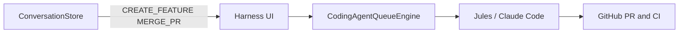

# Julius — LLM project index

Kotlin Multiplatform voice assistant (Android + Android Auto) and **coding harness** (Jules / Claude Code → queue → PR/CI). Use this file as the entry point; follow links for depth.

## Two subsystems (do not conflate)

| Subsystem | Purpose | Key types |
|-----------|---------|-----------|
| **Voice** | Hands-free chat, STT/TTS, `AgentType` providers | `ConversationStore`, `VoiceManager`, `ConversationalAgent` |
| **Harness** | Feature backlog → agent sessions → GitHub PR/CI | `CodingAgentQueueEngine`, `CodingAgentBackend`, `HarnessRoute` |

## Modules

- **`:shared`** — Conversation logic, agents, harness queue, network.
- **`:androidApp`** — Compose UI (phone + Auto), `AndroidVoiceManager`, Koin DI.

## Documentation map

| Doc | When to read |
|-----|----------------|
| [README.md](README.md) | Clone, build, Firebase, quick start |
| [docs/VOICE_AGENTS.md](docs/VOICE_AGENTS.md) | All `AgentType` values, keys, TTS/STT behavior |
| [docs/VOICE_PROCESSING.md](docs/VOICE_PROCESSING.md) | STT/TTS pipeline, barge-in, car mic / Vosk |
| [docs/HARNESS.md](docs/HARNESS.md) | Queue engine, limits, voice commands, routes |
| [docs/ENV_VARS.md](docs/ENV_VARS.md) | `local.properties` / CI env keys |
| [docs/ANDROID_AUTO.md](docs/ANDROID_AUTO.md) | DHU debug, physical car, template constraints |
| [docs/ANDROID_AUTO_DHU_DEBUG.md](docs/ANDROID_AUTO_DHU_DEBUG.md) | Step-by-step DHU + `scripts/run-dhu.sh` |
| [TODO.md](TODO.md) | Roadmap |

Cursor rules (auto-loaded): `.cursor/rules/julius-core.mdc`, `julius-harness.mdc`.

## Key files

| Area | Path |
|------|------|
| Conversation / voice orchestration | `shared/.../shared/conversation/ConversationStore.kt` |
| Voice interface | `shared/.../shared/voice/VoiceManager.kt` |
| Android STT/TTS | `androidApp/.../AndroidVoiceManager.kt` |
| Agent implementations | `shared/.../agents/*.kt` |
| Agent type enum + settings | `androidApp/.../SettingsManager.kt` |
| Runtime agent wiring | `androidApp/.../di/AppModule.kt` (`DynamicAgentWrapper`) |
| Android Auto service | `androidApp/.../auto/VoiceAppService.kt` |
| Harness queue | `shared/.../queue/CodingAgentQueueEngine.kt` |

## Code patterns (short)

1. **Agent selection** — `DynamicAgentWrapper` reads `SettingsManager.settings.selectedAgent`; no Koin reload on switch.
2. **Voice flow** — `VoiceManager.events` + `transcribedText` → `ConversationStore` → `ConversationalAgent.process()`.
3. **Audio** — `AgentResponse.audio` → `playAudio()`; else system TTS via `speak()`.
4. **State** — UI observes `ConversationStore.state` (`StateFlow`).
5. **API keys** — Build: `local.properties` / env → `BuildConfig`. Runtime: `SettingsManager` (overrides build defaults).

## Extended tool actions

When `settings.extendedActionsEnabled`, OpenAI/Gemini (and local agents via `OfflineAgent`) expose: `get_battery_level`, `get_volume_levels`, `play_music`, `play_audiobook`.

## Adding a voice agent

1. Class in `shared/.../agents/` implementing `ConversationalAgent`
2. `AgentType` in `SettingsManager.kt`
3. Branch in `AppModule.kt` / `DynamicAgentWrapper`
4. Settings UI in `SettingsScreen.kt` if keys/models needed

## Build & verify

- **compileSdk / targetSdk:** 36 · **minSdk:** 26 · **app id:** `fr.geoking.julius`
- **Versions:** see `gradle/libs.versions.toml`
- **Before finishing a task:** `./gradlew :androidApp:compileFullDebugKotlin` must pass

## Common pitfalls

- **API keys empty** — Check `local.properties` and in-app Settings (runtime wins).
- **Car mic / offline STT** — Enable car mic; STT engine “Local only/first”; add Vosk under `androidApp/src/main/assets/models/vosk/<model>/`.
- **Auto template crash** — No `Row.setOnClickListener` in `PaneTemplate`; use `ListTemplate` or header/pane actions. See [docs/ANDROID_AUTO.md](docs/ANDROID_AUTO.md).
- **Harness vs voice** — Jules/Claude backends are not `AgentType`; they drive the coding queue only.
