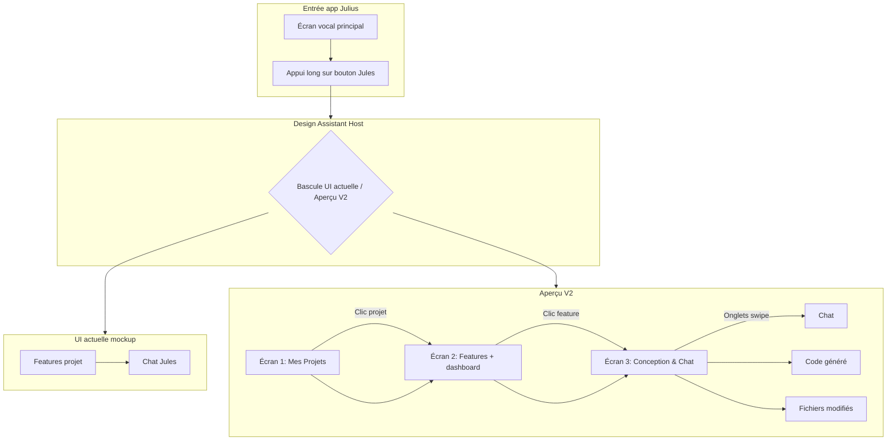

# Jules Design Assistant — Spécification UI V2

Document de conception pour l'interface mobile **Jules Design Assistant** dans le module `androidApp`. Les écrans de production existants (`FeaturesScreen`, `JulesScreen`) restent inchangés ; cette spec décrit l'aperçu parallèle sous `fr.geoking.julius.designassistant`.

## Ce qui reste (UI actuelle / V1)

| Élément | Description |
|--------|-------------|
| Liste Features par projet | Cartes avec pastille de statut (Done, En cours, Todo) |
| Navigation fil d'Ariane simple | `Projets > Nom du projet` |
| Chat Jules | Bulles utilisateur à droite, Jules à gauche avec avatar « J » |
| Blocs code | Affichés dans le fil de discussion |
| Actions PR / branche | Boutons dans les bulles (mockup actuel) |
| Barre de navigation basse | Projets, Features, Chat, Branches, Réglages |
| Palette | Bleu marine `#1A237E` + surfaces blanches |

**Fichiers V1 :** `designassistant/v1/DesignAssistantV1Screens.kt`

## Ce qui est nouveau (V2)

| Écran | Niveau | Nouveautés |
|-------|--------|------------|
| **Mes Projets** | 1 | Nouvel accueil : cartes projet (features, prompts, branche, dernière modif), bouton (+), icône profil |
| **Features** | 2 | Mini-dashboard (En cours / Prêtes / En attente), statuts enrichis (Générée - Prête, Idée / En attente) |
| **Mode Conception & Chat** | 3 | **Panneau contexte persistant** (fil d'Ariane cliquable, bannière branche + PR), **onglets swipe** Chat \| Code généré \| Fichiers modifiés, **raccourcis de prompts** au-dessus de la saisie, **notifications CI** en messages système discrets |

**Fichiers V2 :** `designassistant/v2/DesignAssistantV2Screens.kt`

## Flux de navigation



## Écran 3 — détail (Mode Conception)

```
┌─────────────────────────────────────┐
│ [←] Mode Conception · OAuth         │  Header marine
├─────────────────────────────────────┤
│ Projets › E-Commerce › Feature: OAuth│  Fil d'Ariane (cliquable)
├─────────────────────────────────────┤
│ 🟢 Branch: feature/oauth-auth [📋] │  Bannière technique PERSISTANTE
│ 🚀 Ouvrir PR #42                     │
├─────────────────────────────────────┤
│ [Chat] [Code généré] [Fichiers…]    │  Onglets + swipe horizontal
├─────────────────────────────────────┤
│  … messages / code / fichiers …     │
├─────────────────────────────────────┤
│ [Générer tests] [Corriger bugs] …   │  Raccourcis contextuels
│ [+] [ Message…              ] [➤]  │  Barre de saisie fixe
└─────────────────────────────────────┘
```

## Palette

| Token | Hex | Usage |
|-------|-----|--------|
| Navy | `#1A237E` | Headers, boutons primaires |
| Navy Dark | `#0D1642` | Fond host preview |
| Surface | `#F5F7FF` | Feuilles de contenu |
| Accent | `#3949AB` | Liens PR, chips |

Définition : `DesignAssistantColors.kt`

## Ouvrir l'aperçu dans l'application

1. Lancer l'app Julius sur un appareil ou émulateur.
2. Sur l'écran principal vocal, **maintenir appuyé** le bouton **Jules** (coin bas droit).
3. L'écran **Jules Design Assistant** s'ouvre avec les chips **UI actuelle** / **Aperçu V2**.

Les écrans production restent accessibles via :
- **Features** → bouton liste (FeaturesScreen)
- **Jules** → clic court sur le bouton Jules (JulesScreen)

## Compose Previews dans Android Studio

1. Ouvrir un fichier contenant `@Preview` (ex. `DesignAssistantV2Screens.kt`, `DesignAssistantV1Screens.kt`, `DesignAssistantHost.kt`).
2. Vérifier que le module `androidApp` est sélectionné et qu'une configuration **debug** est active (`debugImplementation` tooling présent).
3. Cliquer sur l'icône **Split** ou **Design** à droite de l'éditeur, ou utiliser **View > Tool Windows > Compose Preview**.
4. Previews disponibles :
   - `V1 Features`, `V1 Chat`
   - `V2 Projets`, `V2 Features`, `V2 Workspace`
   - `Design Assistant Host`

Si les previews ne se rafraîchissent pas : **Build > Make Project**, puis **Build > Refresh Linked Gradle Project**.

## Prochaines étapes (hors scope actuel)

- Brancher les écrans V2 sur `FeatureRepository` / `JulesRepository` (données réelles).
- Remplacer les données `DesignAssistantSampleData` par des ViewModels.
- Feature flag distant ou réglage Settings pour afficher V2 par défaut.
