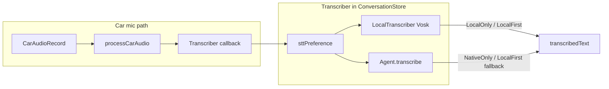

# Vosk offline STT integration – consolidated plan

## Goal

Add Vosk as an optional local speech-to-text engine so the **car mic path** can transcribe offline. Control behavior with a single **STT engine** setting: "Local only", "Local first", or "Native only". The **phone path** stays unchanged (Android `SpeechRecognizer`); the transcriber callback is only used in the car path (`processCarAudio` in [AndroidVoiceManager.kt](androidApp/src/main/kotlin/fr/geoking/julius/AndroidVoiceManager.kt)).

---

## Architecture

- **Shared**: `LocalTranscriber` interface, `SttEnginePreference` enum, and `ConversationStore` composing the transcriber from preference + local + agent.
- **Android**: `VoskTranscriber` implementing `LocalTranscriber`, model (e.g. in assets), setting + UI, DI.

---

## STT engine setting

| Value | Behavior (car mic path only) |
|-------|------------------------------|
| **Local only** | Use only Vosk. No agent fallback; if Vosk returns null, transcript stays empty. |
| **Local first** | Try Vosk first; if null/blank, use `agent.transcribe(audio)` when `agent.isSttSupported`. |
| **Native only** | Do not use Vosk. Use only agent STT when supported (current behavior). |

- Default: **Local first**.
- Preference is read at each transcription via a provider `() -> SttEnginePreference`, so changing the setting takes effect immediately without recreating `ConversationStore`.

---

## Implementation

### 1. Shared

- **`SttEnginePreference`** (e.g. in `shared/.../SttEnginePreference.kt`): enum with `LocalOnly`, `LocalFirst`, `NativeOnly`.
- **`LocalTranscriber`** (e.g. next to `VoiceManager.kt`): interface with `suspend fun transcribe(audioData: ByteArray): String?`.
- **`NoLocalTranscriber`**: object implementing `LocalTranscriber`, always returns `null`.
- **`ConversationStore`** ([ConversationStore.kt](shared/src/commonMain/kotlin/fr/geoking/julius/shared/ConversationStore.kt)):
  - New constructor parameters: `localTranscriber: LocalTranscriber = NoLocalTranscriber`, `sttPreference: () -> SttEnginePreference` (provider).
  - In `init`, set transcriber to:
    - `NativeOnly` → `if (agent.isSttSupported) agent.transcribe(audio) else null`
    - `LocalOnly` → `localTranscriber.transcribe(audio)`
    - `LocalFirst` → `localTranscriber.transcribe(audio) ?: if (agent.isSttSupported) agent.transcribe(audio) else null`

### 2. Android: Vosk

- **Dependency**: Add Vosk Android library (from [vosk-api](https://github.com/alphacep/vosk-api) `android/` – AAR or Maven; if none, document building from source).
- **Model**: One default model (e.g. small EN) in `androidApp/src/main/assets/models/vosk/`; document adding/replacing for other languages. Vosk expects **16 kHz, 16-bit mono PCM**.
- **`VoskTranscriber`** (e.g. `androidApp/.../voice/VoskTranscriber.kt`): implements `LocalTranscriber`; lazy-load model (assets or copy to `filesDir`); run recognition on `Dispatchers.IO`; return `null` if model not loaded or on error. If `CarAudioRecord` format differs from 16 kHz 16-bit mono, add conversion before calling Vosk.

### 3. Android: Settings and UI

- **AppSettings** ([SettingsManager.kt](androidApp/src/main/kotlin/fr/geoking/julius/SettingsManager.kt)): add `sttEnginePreference: SttEnginePreference = SttEnginePreference.LocalFirst`; load/save in SettingsManager (e.g. as string or ordinal).
- **UI**: Dropdown or radio in main settings (and [AutoSettingsScreen.kt](androidApp/src/main/kotlin/fr/geoking/julius/auto/AutoSettingsScreen.kt) if desired): "STT engine" with "Local only (Vosk)", "Local first (Vosk, then cloud)", "Native only (cloud only)".

### 4. DI (Koin)

- In [AppModule.kt](androidApp/src/main/kotlin/fr/geoking/julius/di/AppModule.kt): register `VoskTranscriber` (Context, model path); pass into `ConversationStore`: `localTranscriber = get<VoskTranscriber>()`, `sttPreference = { get<SettingsManager>().settings.value.sttEnginePreference }`.

### 5. Documentation

- [VOICE_PROCESSING.md](docs/VOICE_PROCESSING.md): describe car path transcriber composition and STT engine options.
- [AGENTS.md](AGENTS.md): note optional offline STT (Vosk) and the three STT engine options.

---

## Order of work

1. Shared: `SttEnginePreference`, `LocalTranscriber`, `NoLocalTranscriber`; update `ConversationStore` with composition and provider.
2. Android: Vosk dependency + model; `VoskTranscriber`; DI and `ConversationStore` wiring; then `sttEnginePreference` in settings + UI.
3. Verify car path end-to-end; update docs.

---

## Optional later

- **Streaming**: Feed Vosk partial results into `partialText` for live transcript in car.
- **Phone path**: Option to use Vosk instead of `SpeechRecognizer` (e.g. "Use offline STT everywhere").
- **Multi-language**: User-selectable Vosk model/language (assets or download).
